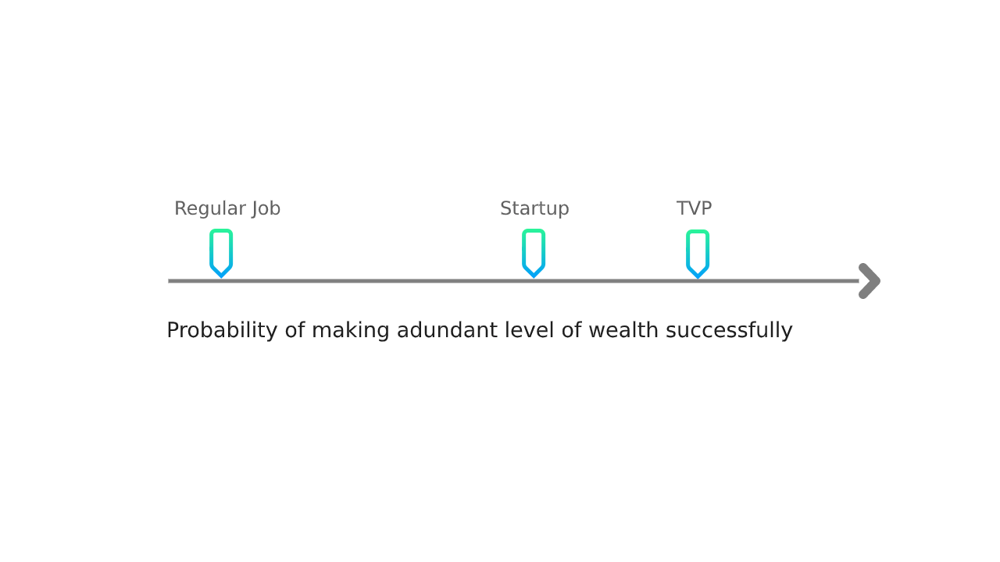

# Long-term Games

### Playing Long-term games with Long-term players

> All benefits in life come from compounding. Whether it’s in relationships, or making money, or in learning.  
> - @naval \| [play long-term games with long-term people](https://nav.al/long-term)

We look for individuals we can compound with, and hence create an opportunity to unlock exponential wealth together.

We do this through:

#### 1. Median Pay

Most jobs fix the ceiling for each role based on minimum affordable 'cost to company'. We don't. We don't see you as cost. For us, you are the asset.  
  
We keep the base lower to afford a higher variance on the upside. And hence, higher upper limits \(if at all\) for you.



### 

#### 2. Equity

Participate in the rewards of your own compounding. 

Level 3 onwards, every individual earns equity as part of their regular compensation.

Equity here is: 

1. **Tokenized:** Permissionless, liquid, and truly yours. 
2. **Full power stocks:** These are not ESOPs. Ownership in your work is rewarded with real ownership in the company, not its illusion.  
3. **Dividend based:** We do not value paper returns \(like VC the path does\). All equity yields annual cash flow for its holders. 

#### 3. Ascend Paths

When growth doesn't occur within a system, it occurs outside. And it costs the system it's existence. 

Ascend path is a guided journey for individual growth within the organization, designed for 10x growth in wealth in 3 years.



#### 

#### 4. Psychological Safety

Truth is the only source of peace. 

Safety does not come from delusional promises of permanency or setting mediocre expectations. Ephemerality is the fundamental nature of the universe.   
  
Safety comes **from being in control.** We help, by striving for an [obvious-less office](https://medium.com/buidl-labs/building-an-obvious-less-office-3ee74d859a89).

