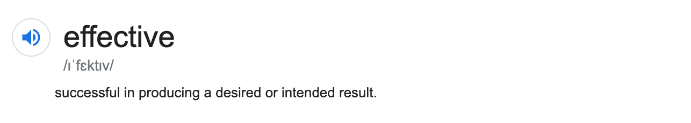

# Effective Communication

## How to Ask effectively

Make your Ask:

**1. Explicit**  
Include what it is that you want the other person to do. If they don't know, they can't deliver.

**2. Complete**  
When you write; before you send it; validate that the receiver will have all the inputs that they need, to deliver the output that you need.

**3. Cognitively Light**  
Easiest asks are the ones that can be responded with a yes/no. Helping them helps you.

## How to respond effectively

**1. Start with Answer first**  
This is contrarian to how most of us are taught to think. Spend time unlearning.

When you speak, you are demanding someone else’s mind space to be at your volition albeit momentarily; be respectful of that leverage, for else it shall wither away very fast in a team of doers.

**2. Focus not on what you want to say, but what you want to communicate**  
The former is about you, the latter is about them.  
Focus on what is it that will get them on the same page. This will require mindfulness.

**3. Choose Data over Opinion**  
Replace adjectives with data:  
eg. The site performance is now much faster ❌  
The site loading speed is now under 9 seconds for complete load ✅

Eliminate weasel words and affirmation biases:  
eg. I see the market moving towards staking ❌  
I see that 30% of the current market would need staking services ✅

Source: [_How to write like an Amazonian_](https://twitter.com/nipunmehra/status/1154590521345490945?lang=en)

Recommended read:

1. [The Pyramid Principle - Lessons from McKinsey](https://medium.com/lessons-from-mckinsey/the-pyramid-principle-f0885dd3c5c7)
2. **Easy Hacks**
3. Think before you speak
4. Prefer writing over speaking
5. Use lists. They are easier to read.

